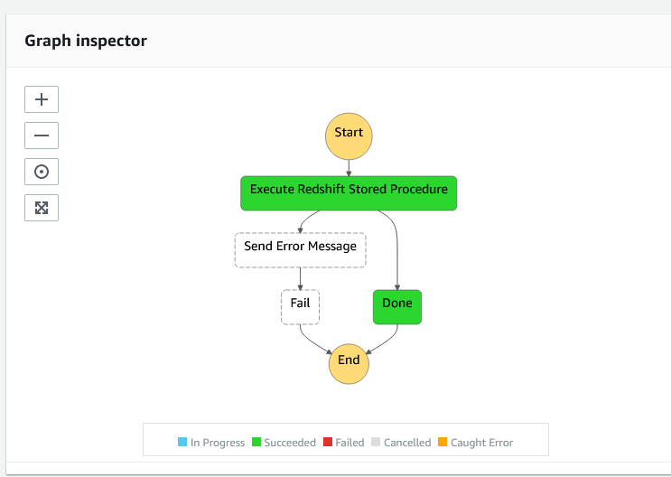

# Building Event Driven Application to run Redshift stored procedures using AWS Lambda, Amazon Redshift Data API, Step Function and Event Bridge

## Introduction

Event driven applications are becoming popular with many customers,
where application execution happens in response to events. A primary
benefit of this architecture is the decoupling of producer and consumer
processes, allowing greater flexibility in application design and
building decoupled processes. An example of an event driven application
that we implemented at our client in an automated Step Function workflow
being triggered by an event, which orchestrates redshift stored
procedures asynchronously using Redshift Data API. This work flow
leverages *[Amazon Redshift](https://aws.amazon.com/redshift/),* [AWS
Lambda](https://aws.amazon.com/lambda/), [Amazon
EventBridge](https://aws.amazon.com/eventbridge/) and [Amazon
DynamoDB](https://aws.amazon.com/sns/).

## Solution architecture

In this solution we will orchestrate redshift stored procedure using
step function, lambda functions, DynamoDB table for tracking step
function task tokens and event bridge. This solution use [AWS Serverless
Application Model (AWS
SAM)](https://docs.aws.amazon.com/serverless-application-model/latest/developerguide/what-is-sam.html)
to deploy the CloudFormation stack.

This event driven, cost effective serverless architecture offers greater
extensibility and simplicity, making it easier to maintain, faster to
release new features and also reduce the impact of changes.

The following architecture diagram highlights the end-to-end solution:

1.  Step Function invokes AWS Lambda by passing task token as payload

2.  Lambda saves the token into DynamoDB reference table and also calls
    redshift stored procedure asynchronously using Redshift Data API

3.  Once Stored proc completes Redshift send event to Event Bridge 

4.  Event bridge calls Lambda function to send status back to step
    function. This lambda reads token from DynamoDB and sends to step
    function to continue the next step.  

## Pre-requisites

### **Setup redshift and stored procedure.**

As a pre-requisite for creating the application explained in this
document, you should need to setup an Amazon Redshift cluster and
associate it with an [<u>AWS Identity and Access Management (IAM)
Role</u>](https://docs.aws.amazon.com/redshift/latest/mgmt/authorizing-redshift-service.html).
If you don’t have that provisioned in your AWS account, please follow
[<u>Amazon Redshift getting started
guide</u>](https://docs.aws.amazon.com/redshift/latest/gsg/getting-started.html)
to set it up.

Connect to redshift using your favorite client like [<u>SQL
Workbench</u>](https://www.sql-workbench.eu/) , copy and paste the code
from scripts/sp_etl_log_etl_event.sql. This code will create stored
procedure which will be orchestrated from step functions. The stored
procedure code is shown below. This procedure simply inserts a message
into public.etl_event table.

--- following procedure inserts timestamp and string into
public.etl_events tables

CREATE OR REPLACE PROCEDURE public.sp_etl_log_etl_event (

   p_event_message IN VARCHAR(65535)

)

AS

\$\$

DECLARE

  v_sql VARCHAR(65535) := '';

BEGIN

  RAISE NOTICE '\[ETL App event message\]\[%\]' , p_event_message;

CREATE TABLE IF NOT EXISTS public.etl_events (

            event_ts timestamp not null ,event_message  VARCHAR(65535)

) backup yes diststyle even;

v_sql := v_sql \|\| 'INSERT INTO public.etl_events (event_ts,
event_message) '\|\|CHR(13);

v_sql := v_sql \|\| 'VALUES (''' \|\| sysdate \|\| ''','''  \|\|CHR(13);

v_sql := v_sql \|\|  p_event_message \|\| ''')' \|\| CHR(13);

RAISE NOTICE '\[SQL Statement\]\[%\]', v_sql;

EXECUTE v_sql;

END;

\$\$ LANGUAGE plpgsql

;

### **Setup Redshift secret manager:**

Open Secret Manager service from AWS console, then click on stored new
secret and create secret to connect to redshift cluster.

##  Deploy CloudFormatin template using clould9 and SAM

# You can launch [AWS clould9](https://aws.amazon.com/cloud9/) instance and making sure you install python3.8 and create a virtual environment.

-   *sudo amazon-linux-extras enable python3.8*

-   ***sudo yum install** python3.8*

-   ***git clone \<This repo>***

-   ***cd redshift-eb-storedprocs***

-   ***python3.8 -m venv venv***

-   ***source venv/bin/activate***

-   ***pip install –r requirement.txt***

-   ***sam build***

-   ***sam deploy –guided***

During guided deployment stack will except following parameters to be
passed as shown in above picture.

-   Stack Name – Provide a friendly name.

-   StackPrefix – Provide a friendly name.

-   DynamoDbBillingMode – Specify how you are charged for read and write
    throughput and how you manage capacity.

-   DynamoDbPointInTimeRecovery – Enable point in time recovery DynamoDB
    table backups

-   SubnetIds – Specify the VPC subnets to deploy the lambda functions.
    The subnet IDs are comma separated with no spaces. Only needed if
    using a VPC deployment.

-   SecGroup – Specify Security group to deploy the lambda functions.
    The Security group are comma separated with no spaces. Only needed
    if using a VPC deployment.

-   DbSecretArn: Provide redshift secret ARN that was created in above
    step.

-   RedshiftDbName – Redshift data base name, this parameter used for
    Redshift Data API.

-   ClusterIdentifier – Redshift Cluster ID, This parameter used for
    Redshift Data API.

-   DynamodbMetaTable – DynamoDB metadata table to store Step Function
    Token.

-   SupportNotificationEmail: Provide Email address for SNS topic in
    case of failures.

-   REGION: AWS Region used in redshift data api CLI calls.

> After providing all the parameters , stack will be deployed as shown
> below.
>
> 

## Deployed Artifacts:

## Step Function:

**<u>RedshiftDataApiSPProcesStateMachine</u>** : This state machine
Orchestrates Redshift stored procedures. . [AWS Step
Functions](https://aws.amazon.com/step-functions/?step-functions.sort-by=item.additionalFields.postDateTime&step-functions.sort-order=desc)
is a serverless function orchestrator that makes it easy to sequence AWS
Lambda functions and multiple AWS services into business-critical
applications. This AWS Step Functions pause during a task, and wait for
an external process to return a task token that was generated when the
task started.

State machine expects following payload as input parameter

*{*

*"spname" : "public.sp_etl_log_etl_event",*

*"event_message": "ETL Load Process started"*

*}*

*Deployed state machine is shown below*

## Lambda functions -

This stack will deploy 2 lambda functions , function one send SQL
statement to redshift, Function to check status of SQL query and informs
the status of query back to step function.

1.  **<u>RedshiftRunSpsFunction</u>: -** This function invokes Redshift
    Data API asynchronously and saves the task token provided by Step
    Function into DynamoDB table. This function creates statement name
    as show below and passed this statement name as parameter to
    redshift data api.

statementName = "redshift-storedproc-event-\|" + str(current_time)

Function also saves statement name along with Step Function task token
in Dynamodb table. We can pass the task token to redshift data api along
with statement name, however there is a limitation on statement name
length. Hence, we have to store task token in DynamoDB table so that we
can be retrieve it in next step.

1.  **StepFunctionCallBack**:- This function invoked by event bridge
    event rule upon completion of redshift query, this function makes
    call to redshift data api describes statement to check status of SQL
    query.

> This function retrieves task token from DynamoDB and return to step
> function along with statement result and task token for further
> processing.

## Lambda Layers -

This stack will deploy 2 lambda layers.

-   **AwsDataWranglerLayer** : This layer installs awswrangle python
    library. [awswrangler](https://github.com/awslabs/aws-data-wrangler)
    is [AWS Professional
    Service](https://aws.amazon.com/professional-services) open source
    initiative 

-   **AwsLambdaPowertoolsPythonLayer** : This layer uses [AWS Lambda
    Power
    tools](https://github.com/awslabs/aws-lambda-powertools-python)
    (Python), A suite of Python utilities for AWS Lambda functions to
    ease adopting best practices such as tracing, structured logging,
    custom metrics, and more

## DynamoDB tables –

## DynamoDbTableMeta : - This table is used for storing and retrieving step function call back token before and after the unload. For additional information about call back token refer to this [link](https://docs.aws.amazon.com/step-functions/latest/dg/connect-to-resource.html)

##

##

## EventBridge Rule –

1.  **EventBridgeRedshiftEventRule** : Amazon EventBridge rule, to
    automatically capture redshift stored procedure execution completion
    event, generated by redshift SQL command. This triggers call back
    Lambda function again with status of SQL statement. This event rule
    is looking for ay Statement Name with *“redshift-storedproc-event-“*
    as shown below.

# Testing the code:

1.  After setting up above solution, you should have a step function as
    shown below, you can manually start the step function by passing the
    below payload. You can setup Amazon EventBridge scheduled rule’s
    cron expression to run this workflow at fixed intervals. You may
    view Amazon CloudWatch logs and troubleshoot issues if any in the
    lambda function fails. Below is an example of the execution logs for
    reference:

Upon successful run your step function should look as shown below.

1.  You could also view DynamoDB table to validate if the data is moved
    from redshift into DynamoDB table.

2.  Any failures this process send input payload message to SNS topic
    for support team to receive the notification email in case of any
    failures.

**Conclusion**

Step Functions is a serverless orchestration and Amazon Redshift Data
API enables you to painlessly interact with Amazon Redshift and enables
you to build event-driven and cloud native applications. We demonstrated
how to build an event driven application that can orchestrate redshift
stored procedures. To learn more about Amazon Redshift Data API, please
visit the
[<u>documentation</u>](https://docs.aws.amazon.com/redshift/latest/mgmt/data-api.html).
